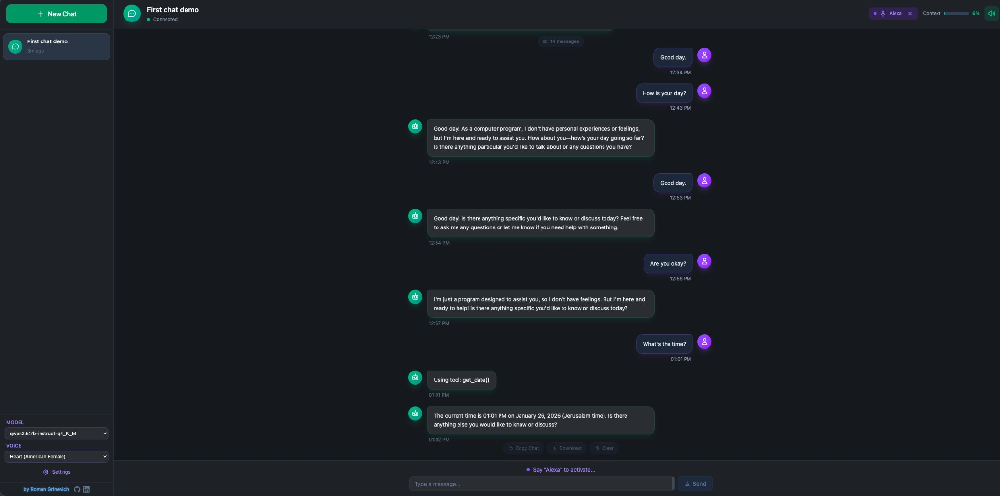

# Local Voice Chatbot

<p align="center">
  <strong>A fully local, privacy-first voice assistant for macOS</strong>
</p>

<p align="center">
  <a href="#features">Features</a> •
  <a href="#requirements">Requirements</a> •
  <a href="#quick-start">Quick Start</a> •
  <a href="#installation">Installation</a> •
  <a href="#usage">Usage</a> •
  <a href="#configuration">Configuration</a> •
  <a href="#troubleshooting">Troubleshooting</a>
</p>

<p align="center">
  
</p>

---

## Overview

Local Voice Chatbot is a fully offline voice assistant that runs entirely on your Mac. It combines state-of-the-art open-source models to deliver a natural conversational experience without sending any data to the cloud.

**Key Technologies:**
- **Ollama + Qwen3-8B** — Conversational LLM for intelligent responses
- **MLX Whisper** — Fast speech-to-text optimized for Apple Silicon
- **Kokoro** — Natural text-to-speech with multiple voice options
- **Silero VAD** — Accurate voice activity detection

> **No cloud services. No API keys. Complete privacy.**

---

## Features

| Feature | Description |
|---------|-------------|
| **Sub-second Latency** | Streaming architecture enables natural, real-time conversations |
| **Voice & Text Modes** | Use microphone input or type your messages |
| **Modern Web Interface** | Beautiful React-based UI with dark theme |
| **Multiple Voices** | Choose from American and British English voices |
| **Conversation Memory** | Maintains context throughout your chat session |
| **100% Offline** | All processing happens locally on your machine |

---

## Requirements

### System Requirements

| Requirement | Minimum | Recommended |
|-------------|---------|-------------|
| **Operating System** | macOS 12+ | macOS 14+ |
| **Processor** | Apple Silicon (M1) | M2/M3/M4 |
| **RAM** | 8GB | 16GB+ |
| **Disk Space** | 10GB | 15GB |
| **Python** | 3.10 | 3.12+ |

> **Note:** Intel Macs are supported but will have reduced performance. 8GB RAM users should use smaller models (see [Configuration](#alternative-models)).

### Required Software

| Software | Purpose | Installation |
|----------|---------|--------------|
| **Ollama** | LLM inference engine | `brew install ollama` |
| **Node.js** | Frontend development | `brew install node` |
| **Homebrew** | Package manager | [brew.sh](https://brew.sh) |

---

## Ollama Setup (Required)

**Ollama is required to run the chatbot.** It provides the LLM backend that powers all conversations.

### Step 1: Install Ollama

```bash
brew install ollama
```

Or download directly from [ollama.com](https://ollama.com).

### Step 2: Start Ollama Service

```bash
ollama serve
```

> **Tip:** Ollama runs as a background service. You can also configure it to start automatically on login.

### Step 3: Download a Model

```bash
# Recommended model (requires 16GB RAM)
ollama pull qwen3:8b

# Alternative for 8GB RAM systems
ollama pull llama3.2:3b
```

### Verify Installation

```bash
# Check if Ollama is running
curl http://localhost:11434/api/tags

# List installed models
ollama list
```

> **Important:** The chatbot will not function without Ollama running and at least one model installed. Ensure Ollama is started before launching the application.

---

## Quick Start

### One-Command Start (Recommended)

```bash
./start.sh
```

This script automatically:
1. Creates Python virtual environment (if needed)
2. Installs frontend dependencies (if needed)
3. Verifies Ollama is running and model is available
4. Starts the backend API server
5. Starts the frontend development server
6. Opens the application at `http://localhost:5173`

Press `Ctrl+C` to stop all services.

---

## Installation

### Automated Installation

```bash
# Make the setup script executable
chmod +x scripts/setup_models.sh

# Run the setup script
./scripts/setup_models.sh
```

The setup script will:
- Install Homebrew packages (portaudio, ffmpeg)
- Install and configure Ollama
- Download the Qwen3-8B model
- Set up Python environment with uv
- Pre-download ML models for faster first launch

### Manual Installation

#### 1. Install System Dependencies

```bash
# Install Homebrew if not already installed
/bin/bash -c "$(curl -fsSL https://raw.githubusercontent.com/Homebrew/install/HEAD/install.sh)"

# Install required packages
brew install portaudio ffmpeg ollama node
```

#### 2. Configure Ollama

```bash
# Start Ollama service
ollama serve

# Download the recommended model (in a new terminal)
ollama pull qwen3:8b
```

#### 3. Set Up Python Environment

**Using uv (Recommended):**

```bash
# Install uv package manager
curl -LsSf https://astral.sh/uv/install.sh | sh

# Create virtual environment
uv venv

# Activate environment
source .venv/bin/activate

# Install dependencies
uv pip install -e .
```

**Using pip:**

```bash
# Create virtual environment
python3 -m venv .venv

# Activate environment
source .venv/bin/activate

# Install dependencies
pip install -e .
```

#### 4. Set Up Frontend

```bash
cd frontend
npm install
cd ..
```

#### 5. Verify Installation

```bash
source .venv/bin/activate
python -m src.main --check
```

---

## Usage

### Starting the Application

**Full Stack (Recommended):**

```bash
./start.sh
```

Then open `http://localhost:5173` in your browser.

**Manual Start:**

```bash
# Terminal 1: Start backend
source .venv/bin/activate
python -m src.main --web

# Terminal 2: Start frontend
cd frontend
npm run dev
```

### Command Line Interface

```bash
python -m src.main [OPTIONS]
```

| Option | Short | Description |
|--------|-------|-------------|
| `--text` | `-t` | Use text input instead of voice |
| `--no-tts` | | Disable text-to-speech output |
| `--web` | `-w` | Start web interface |
| `--host HOST` | | Web server host (default: 0.0.0.0) |
| `--port PORT` | `-p` | Web server port (default: 8000) |
| `--check` | | Check system requirements |
| `--list-devices` | | List available audio devices |
| `--list-voices` | | List available TTS voices |
| `--help` | | Show help message |

### Examples

```bash
# Voice chat (requires microphone)
python -m src.main

# Text chat with speech output
python -m src.main --text

# Text chat without speech (quiet mode)
python -m src.main --text --no-tts

# Web interface on custom port
python -m src.main --web --port 3000

# Check system requirements
python -m src.main --check
```

---

## Configuration

### Environment Variables

Create a `.env` file in the project root to customize settings. Copy from the provided example:

```bash
cp .env.example .env
```

### LLM Settings

| Variable | Default | Description |
|----------|---------|-------------|
| `LLM_BASE_URL` | `http://localhost:11434` | Ollama API endpoint |
| `LLM_MODEL_NAME` | `qwen3:8b` | Model to use for chat |
| `LLM_TEMPERATURE` | `0.7` | Response creativity (0.0-1.0) |
| `LLM_MAX_TOKENS` | `512` | Maximum response length |

### Speech-to-Text Settings

| Variable | Default | Description |
|----------|---------|-------------|
| `STT_MODEL_NAME` | `mlx-community/whisper-large-v3-turbo` | Whisper model variant |
| `STT_LANGUAGE` | `en` | Language for transcription |

### Text-to-Speech Settings

| Variable | Default | Description |
|----------|---------|-------------|
| `TTS_VOICE` | `af_heart` | Voice selection (see below) |
| `TTS_SPEED` | `1.0` | Speech speed multiplier |
| `TTS_OUTPUT_SAMPLE_RATE` | `24000` | Audio sample rate |

### Available Voices

| Voice ID | Description |
|----------|-------------|
| `af_heart` | American Female - Heart (warm, friendly) |
| `af_bella` | American Female - Bella |
| `af_sarah` | American Female - Sarah |
| `af_nicole` | American Female - Nicole |
| `af_sky` | American Female - Sky |
| `am_adam` | American Male - Adam |
| `am_michael` | American Male - Michael |
| `bf_emma` | British Female - Emma |
| `bf_isabella` | British Female - Isabella |
| `bm_george` | British Male - George |
| `bm_lewis` | British Male - Lewis |

### Voice Activity Detection

| Variable | Default | Description |
|----------|---------|-------------|
| `VAD_THRESHOLD` | `0.5` | Speech detection sensitivity |
| `VAD_MIN_SPEECH_DURATION_MS` | `250` | Minimum speech duration |
| `VAD_MIN_SILENCE_DURATION_MS` | `500` | Silence before end of speech |
| `VAD_SPEECH_PAD_MS` | `30` | Padding around speech |

### Alternative Models

For systems with limited RAM:

```bash
# 8GB RAM - Use smaller model
ollama pull llama3.2:3b

# Update .env
LLM_MODEL_NAME=llama3.2:3b
```

---

## Architecture

```
┌─────────────┐     ┌─────────────┐     ┌─────────────┐
│ Microphone  │────▶│  Silero VAD │────▶│ MLX Whisper │
└─────────────┘     └─────────────┘     └─────────────┘
                                               │
                                               ▼
┌─────────────┐     ┌─────────────┐     ┌─────────────┐
│   Speaker   │◀────│   Kokoro    │◀────│  Qwen3-8B   │
└─────────────┘     │    TTS      │     │ via Ollama  │
                    └─────────────┘     └─────────────┘
                           ▲
                           │
                    ┌─────────────┐
                    │ Sentencizer │
                    │ (streaming) │
                    └─────────────┘
```

### Streaming Pipeline

The key to achieving low latency is streaming at every stage:

1. **VAD** — Detects when you start and stop speaking
2. **STT** — Transcribes speech as audio arrives
3. **LLM** — Streams tokens as they're generated
4. **Sentencizer** — Buffers tokens until a sentence is complete
5. **TTS** — Speaks each sentence while LLM continues generating

> This architecture allows the assistant to start speaking before it finishes thinking, creating a natural conversational flow.

---

## Project Structure

```
local-voice-chatbot/
├── src/                      # Python backend
│   ├── main.py               # Application entry point
│   ├── config.py             # Settings and configuration
│   ├── pipeline/
│   │   ├── vad.py            # Voice activity detection
│   │   ├── stt.py            # Speech-to-text (Whisper)
│   │   ├── llm.py            # LLM client (Ollama)
│   │   ├── tts.py            # Text-to-speech (Kokoro)
│   │   └── sentencizer.py    # Sentence boundary detection
│   ├── audio/
│   │   ├── capture.py        # Microphone input
│   │   └── playback.py       # Speaker output
│   ├── interfaces/
│   │   ├── cli.py            # Terminal interface
│   │   └── web.py            # Web API + WebSocket
│   └── storage/
│       └── conversations.py  # Conversation persistence
├── frontend/                 # React frontend
│   ├── src/
│   │   ├── App.tsx           # Main application
│   │   ├── components/       # UI components
│   │   ├── hooks/            # Custom React hooks
│   │   ├── types/            # TypeScript types
│   │   └── utils/            # Utility functions
│   ├── package.json
│   └── vite.config.ts
├── web/
│   └── index.html            # Legacy Web UI
├── scripts/
│   └── setup_models.sh       # Automated setup script
├── start.sh                  # One-command start script
├── pyproject.toml            # Python project configuration
└── README.md
```

---

## Troubleshooting

### Ollama Issues

**"Ollama not running"**

```bash
# Start Ollama service
ollama serve

# Verify it's running
curl http://localhost:11434/api/tags
```

**"Model not found"**

```bash
# List available models
ollama list

# Download the required model
ollama pull qwen3:8b
```

### Audio Issues

**"No audio devices found"**

```bash
# Install portaudio
brew install portaudio

# Reinstall sounddevice
source .venv/bin/activate
pip install --force-reinstall sounddevice
```

**"Microphone not working"**

1. Check System Preferences → Privacy & Security → Microphone
2. Ensure your terminal/browser has microphone permissions
3. Run `python -m src.main --list-devices` to verify device detection

### Performance Issues

**Slow response times:**

1. Verify you're running on Apple Silicon (not Rosetta)
2. Close memory-intensive applications
3. Consider using a smaller model: `ollama pull llama3.2:3b`

**High memory usage:**

Expected memory consumption:
| Component | Memory Usage |
|-----------|--------------|
| Qwen3-8B (4-bit) | ~5GB |
| Whisper | ~1.5GB |
| Kokoro | ~100MB |
| System overhead | ~2GB |

For 8GB Macs, switch to `llama3.2:3b` model.

### Frontend Issues

**"Frontend failed to start"**

```bash
# Check for errors in the log
cat /tmp/voice-chatbot-frontend.log

# Reinstall dependencies
cd frontend
rm -rf node_modules package-lock.json
npm install
```

**Port already in use:**

```bash
# Kill processes on the ports
lsof -ti:8000 | xargs kill -9
lsof -ti:5173 | xargs kill -9
```

---

## Development

### Backend Development

```bash
# Activate environment
source .venv/bin/activate

# Run with auto-reload (for development)
python -m src.main --web --reload

# Run tests
pytest

# Lint code
ruff check src/
```

### Frontend Development

```bash
cd frontend

# Start development server with hot reload
npm run dev

# Build for production
npm run build

# Lint code
npm run lint
```

### Tech Stack

**Backend:**
- FastAPI — Web framework
- Uvicorn — ASGI server
- WebSockets — Real-time communication

**Frontend:**
- React — UI library
- TypeScript — Type-safe JavaScript
- Vite — Build tool
- Tailwind CSS — Styling

---

## License

MIT License — feel free to use and modify for your projects.

---

## Acknowledgments

This project builds on these amazing open-source projects:

- [Ollama](https://ollama.com) — Easy local LLM deployment
- [MLX](https://github.com/ml-explore/mlx) — Apple Silicon optimization
- [Kokoro](https://github.com/hexgrad/kokoro) — High-quality TTS
- [Silero VAD](https://github.com/snakers4/silero-vad) — Voice activity detection
- [Faster Whisper](https://github.com/SYSTRAN/faster-whisper) — Efficient speech recognition

---

## Developed By

<p align="center">
  <strong>Roman Grinevich</strong>
</p>

<p align="center">
  <a href="https://github.com/rg1989">
    
  </a>
  &nbsp;
  <a href="https://www.linkedin.com/in/roman-grinevich-03b13bab/">
    
  </a>
</p>

---

<p align="center">
  Made with ❤️ for the open-source community
</p>
